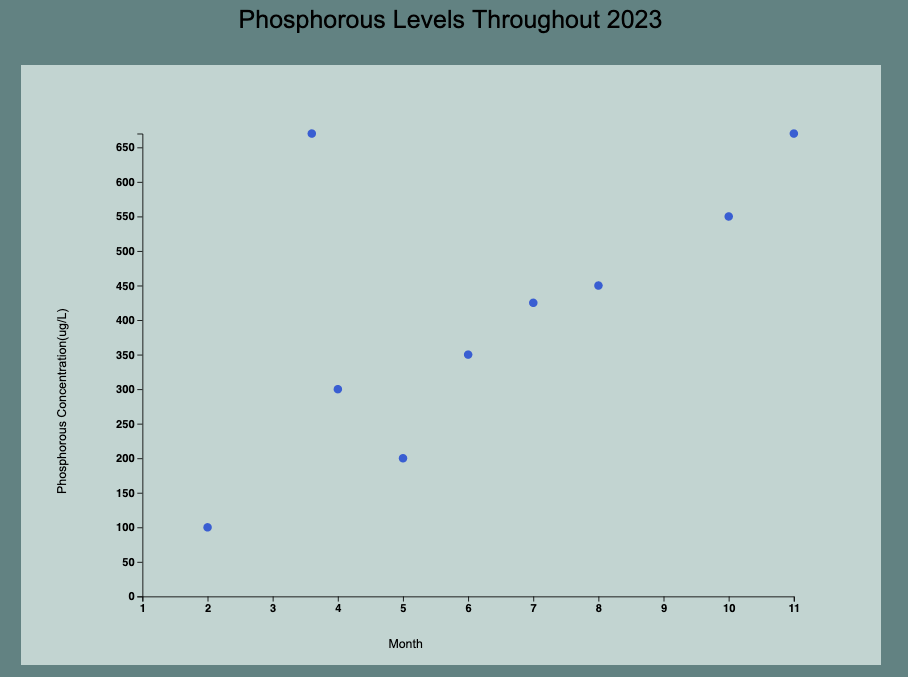

# Phosphorous Level vs. Month Example
- This is an example output of my data visualization tool using data similiar to that 
which may be collected for phosphorous levels over the season.

# Steps Involved in creating:

## 1. Start Screen
- Initially the app starts at this screen

## 2. Select graph type 
- Once the graph type is selected, it displays info on how to format the .csv 
file to input

## 3. Upload formatted .csv file and submit
- Once the file is uploaded, it will output the graph

