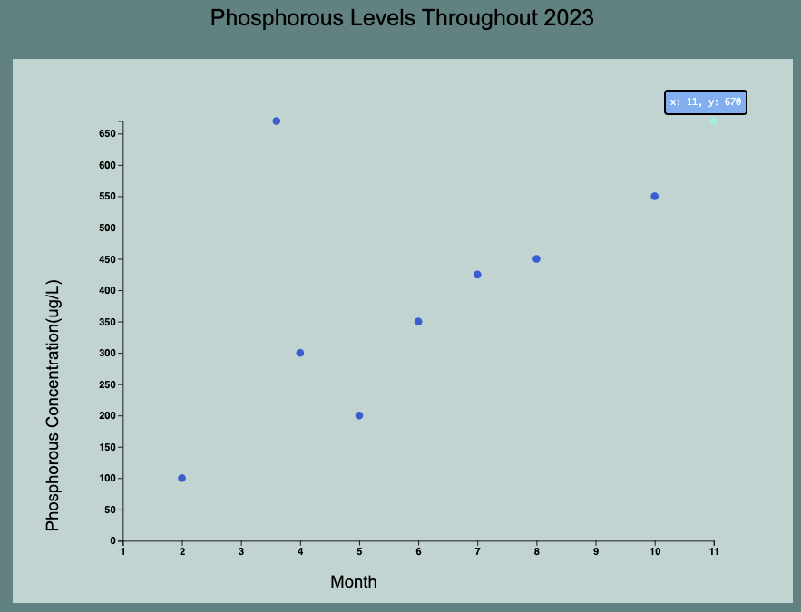
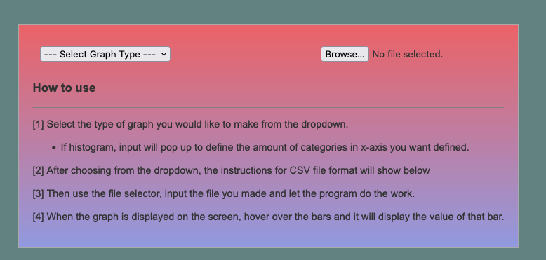
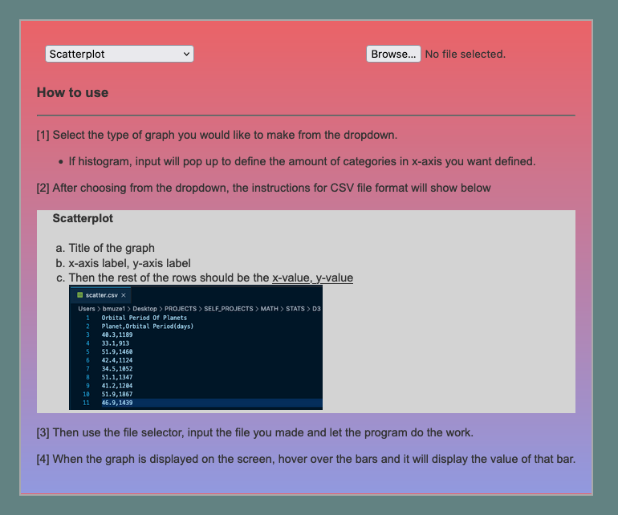

# Phosphorous Level vs. Month Example
- This is an example output of my data visualization tool for my application to 
the Lake Winnipeg Foundation. I created a .csv file (<a href="https://github.com/B-Musick/graph-maker/blob/master/TEST_FILES/phosphorous_levels/scatterplot.csv">link</a>) using data similiar to that which might be
found on the LWF DataStream website, used for monitoring phosphorous levels over the season.

- You can see in the image on the rightmost point that when I hover over the point, 
it highlights it and shows the associated data with that point.

# Steps Involved in creating:

## 1. Start Screen
- Initially the app starts at this screen

## 2. Select graph type 
- Once the graph type is selected, it displays info on how to format the .csv 
file to input

## 3. Upload formatted .csv file and submit
- Once the file is uploaded, it will output the graph

# Sources
- Lake Winnipeg Foundation: https://lakewinnipegfoundation.org/ 
- DataStream: https://lakewinnipegdatastream.ca/